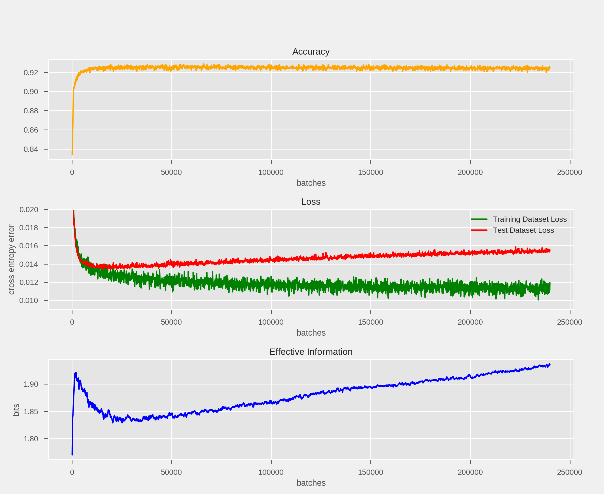

```
 _______             _
|__   __|           | |                               _---~~(~~-_.
   | | ___  _ __ ___| |__ ______                    _{        )   )
   | |/ _ \| '__/ __| '_ \______|                 ,   ) -~~- ( ,-' )_
   | | (_) | | | (__| | | |                      (  `-,_..`., )-- '_,)
 __|_|\___/|_|  \___|_| |_|      _     _        ( ` _)  (  -~( -_ `,  }
|  ____|                (_)     | |   | |       (_-  _  ~_-~~~~`,  ,' )
| |__ ___  _ __ ___  ___ _  __ _| |__ | |_        `~ ->(    __;-,((()))
|  __/ _ \| '__/ _ \/ __| |/ _` | '_ \| __|             ~~~~ {_ -_(())
| | | (_) | | |  __/\__ \ | (_| | | | | |_                     `\  }
|_|  \___/|_|  \___||___/_|\__, |_| |_|\__|                      { }
                            __/ |
                           |___/
```

This package provides a collection of modules useful for characterizing and predicting the dynamics and performance of neural nets. These consist mostly of novel metrics, derived from fields like theoretical neuroscience and information theory, aimed at helping researchers to better understand and predict the performance of neural networks. The repository is meant to advance a new "Science of AI" or "Science of Deep Learning" (see [neuralnet.science](neuralnet.science)). It currently includes modules for computing:

* [Effective Information](https://arxiv.org/abs/1907.03902)

With the following under development:
- [] [Gradient Noise Scale](https://openai.com/blog/science-of-ai/)
- [] [Information Bottleneck](https://arxiv.org/abs/1503.02406)


## Installation

(Requires pytorch to already be installed)
```
pip install git+https://github.com/ejmichaud/torch-foresight.git
```

## Usage:

Computing effective information:

```python
import foresight.ei as ei

device = torch.device('cuda' if torch.cuda.is_available() else 'cpu')

... (define model, data loaders) ...

input = next(iter(data_loader))[0].to(device) # get a batch to run model on
EI = ei.ei(model, input=input, device=device)
```

Effective information may prove a useful metric in characterizing the learning (generalization) and overfitting phases of a neural network. Here is an example of how it evolves during the training of a single layer (no hidden layers) softmax network:


