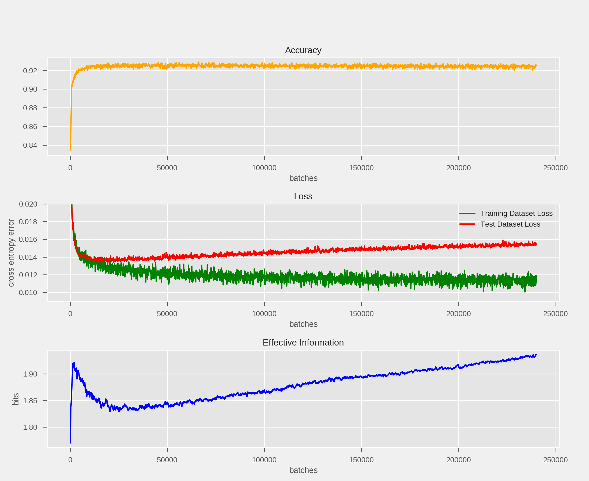

Effective Information
=====================

Theory
^^^^^^

`Effective Information <https://arxiv.org/abs/1907.03902>`_ captures something about the information contained in the causal structure of a network (realized as a causal diagram). It is defined as:

.. math::
	 H( \langle W^\text{out} \rangle ) - \text{EI} = \langle H(W^\text{out}) \rangle

or equivalently:

.. math::
	\text{EI} = \frac{1}{N}\sum_i D_\text{KL}[W_i^\text{out} \ || \ \langle W_i^\text{out} \rangle ]

How this quantity evolves during the training of artificial neural networks may illustrate important dynamics of the network, such as "phase changes" during training (such as a transition from generalization to overfitting):

Above, we see how the effective information of a single-layer (no hidden layers) neural network evolves during training. There appears to be a phase of rapid growth (coinciding with the fast, early drop in training and test loss), then a period of decay and leveling off (during which the test dataset loss levels off), folllowed by a phase of slow increase (during which training dataset loss decreases, but test dataset loss increases) as the network "overfits" the data.

Code Documentation
^^^^^^^^^^^^^^^^^^

.. autoapimodule:: foresight.ei
   :members: ei, determinism, degeneracy, get_shapes, H, lin_norm, soft_norm

